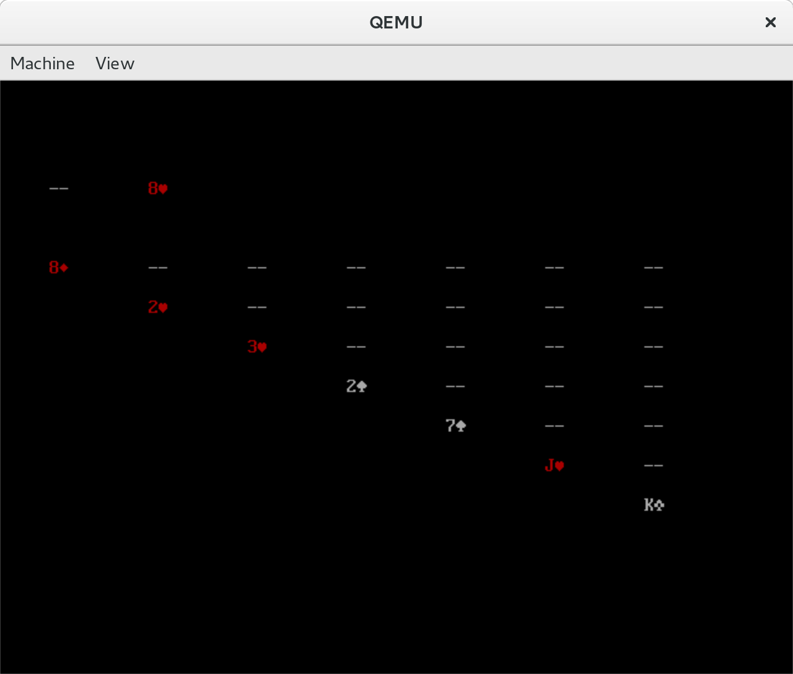

# boot2sol

Solitaire. Written inside the bootloader.

## Overview
As part of Move Inc.'s Startup Hackathon, 2016, our team decided to write
solitaire within a bootloader. The goal is to boot a PC with a traditional BIOS
(no EFI) into an interactive game of solitaire. Introduction video:

## Team Members
* Brian Masney - [masneyb](https://github.com/masneyb)
* Brian Sizemore - [bpsizemore](https://github.com/bpsizemore)
* Ricky Hussmann - [rhussmann](https://github.com/rhussmann)
* Will Austin - [dreae](https://github.com/dreae)

## Technical Requirements
* Must be written in 16-bit x86 assembly language
* Program code and data must fit on a single sector on disk
  * 512 bytes total
  * Last 2 bytes is the boot sector signature (AA55h)
  * Only **510 bytes** total available for our data and code
* System running in real mode; no memory production available
* Limited tooling available for debugging issues
* Requires detailed knowledge of x86 architecture

## Development Toolchain
* Developed in Linux
  * Brian M. and Will used Fedora natively
  * Brian S. used Fedora under Virtualbox
  * Ricky H. used Ubuntu under VMWare
* NASM used for assembly
* mkdosfs used to create the boot floppy
* QEMU for virtualizing the hardware

## Design
There are thirteen piles in solitaire:
* The draw pile
* The discard pile
* A pile for each completed suit (four piles)
* Seven play piles

We included another pile, the space between the discard pile and the suit piles.
This pile is never added to or drawn from, but its existence simplifies the
implementation. So, boot2sol recognizes a total of 14 piles, zero indexed.

The cards in each pile are represented as a linked list. 14 bytes of data are
reserved for the head of each pile in the list.

The representation of each card uses two bytes:

Family | Unused | Card Value | Shown | Offset to next card
-------|--------|------------|-------|-----
2 bits | 2 bits | 4 bits     | 1 bit | 7 bits

The end of the linked list in the next pointer is represented with the value
0x1111111.

## How to run the game

* Fedora Linux users should only need to run `sudo dnf install qemu-system-x86 nasm`
  to fetch the necessary dependencies.
* Debian/Ubuntu Linux users should only need to run `sudo apt-get install qemu-system-x86 nasm`
  to fetch the necessary dependencies.
* `make run` to compile the program and launch it in a VM on your local machine using QEMU.
* To run it on bare metal, run `make` to compile and `dd if=boot.bin of=/dev/sdX bs=512 count=1`,
  where sdX is the path to a thumb drive that you want to boot from. Beware: This will
  destroy any data you have on your thumb drive.

## Keyboard commands
* The `d` key advances the draw pile.
* The `m` key is used to move one or more cards from one pile to another. It takes three additional keyboard commands:
  * Source pile number (See table below)
  * Source pile card number (from the top of the list). Allowed values: 1-9
  * Destination pile number (See table below)

## Pile numbering

The move command takes a source and destination pile number that is represented
by the following table:

 a | b |   | d | e | f | g
---|---|---|---|---|---|---
 h | i | j | k | l | m | n

## Example

You can press `mn4k` to move the 4th card on pile n (bottom right) to the end of pile k.

## Limitations

Due to the limited space available, the program currently does little to no validation and
does not hide the cards that shouldn't be shown.

## Screenshot

